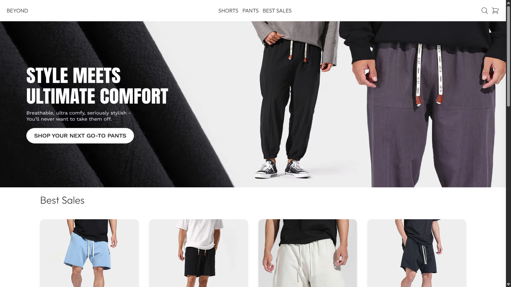
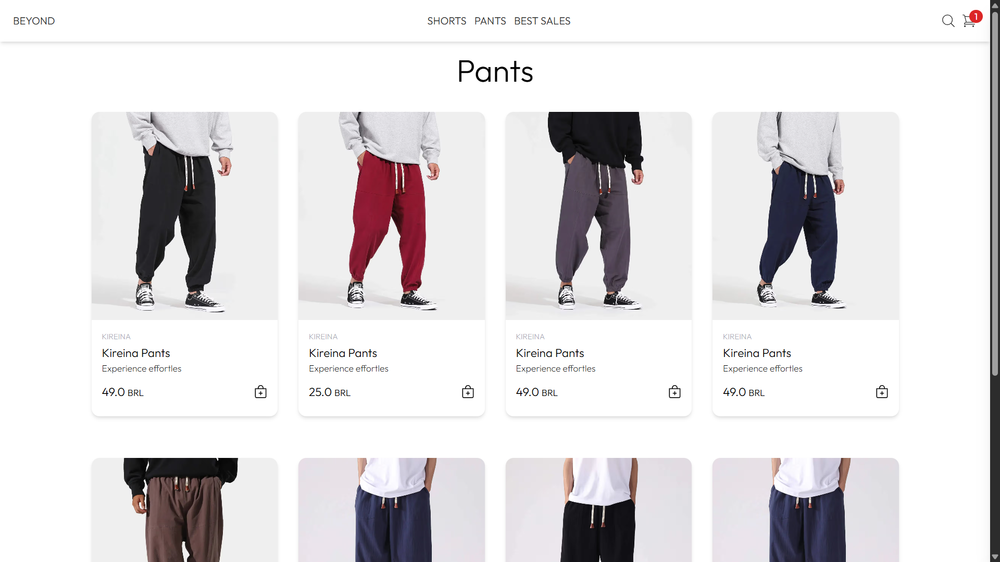
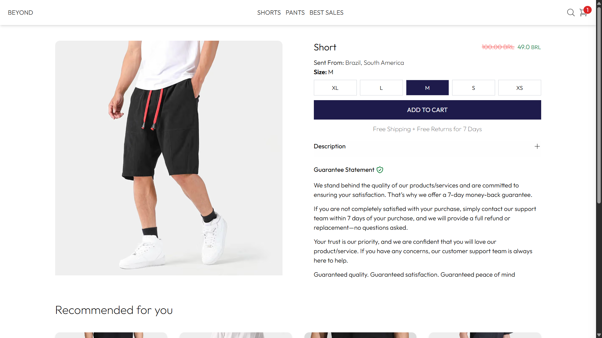
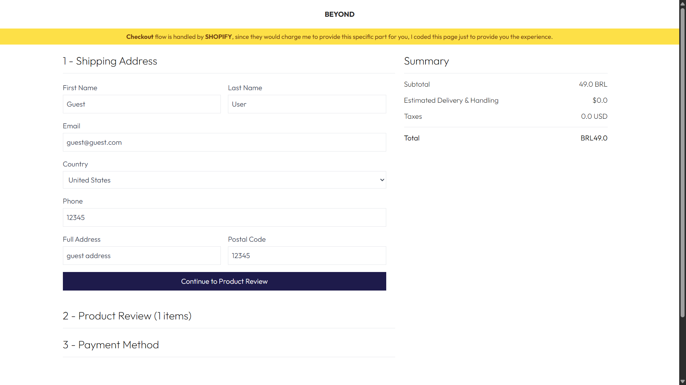
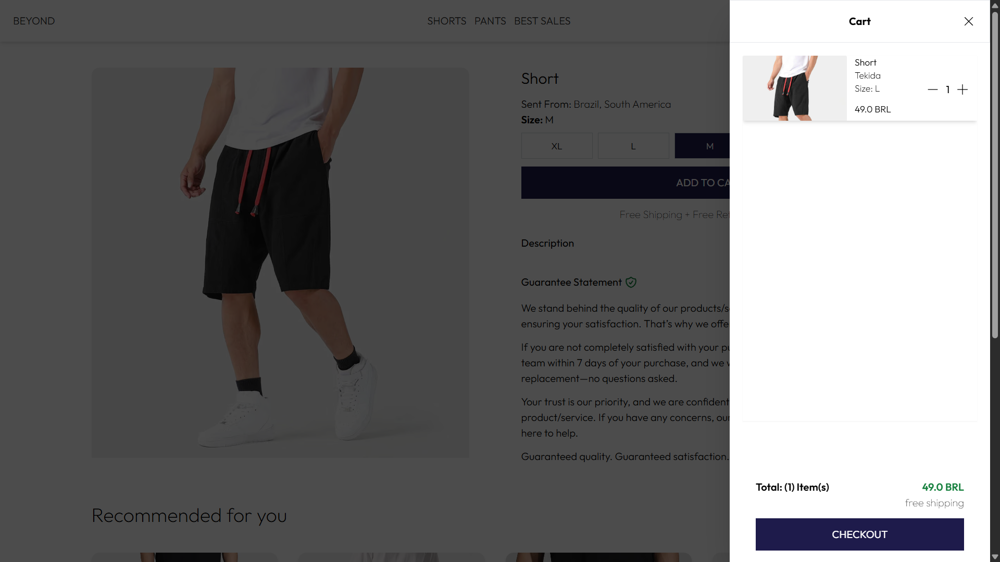
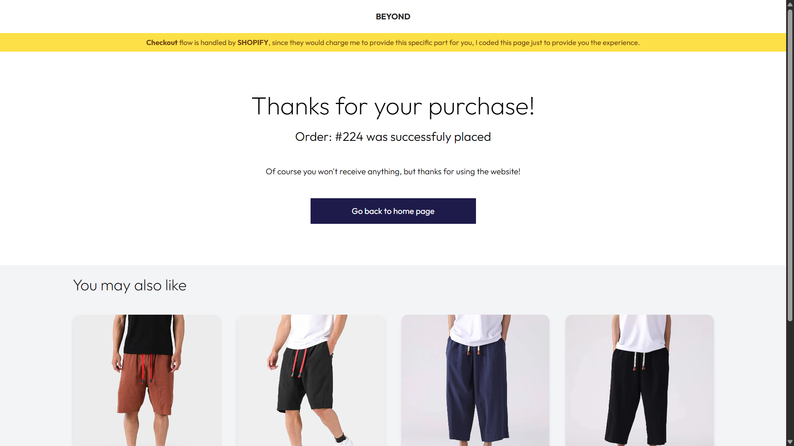
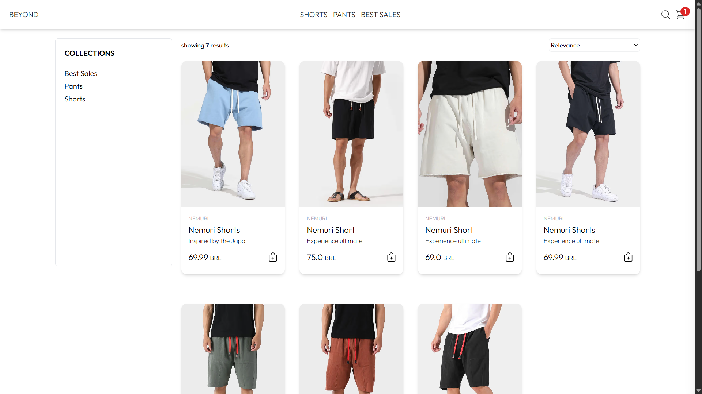

# Beyond - Clothes Store

@todo

## Description

This project was created to study Shopify and understand how communication between products, collections and pages work using the Shopify StoreFront API.

## Usage

To run the project, it is necessary to configure some settings in the Shopify platform—such as adding products, collections, pages and setting up API key permissions.

I am currently exploring whether Shopify provides a way to export these configurations. If I find anything, I will update this section accordingly.

If you're reading this, it's probably because I haven't found a solution yet.

## Screenshots

Desktop: 

Mobile: 

## License

@todo

## Contact

@todo
