# Beyond - Clothes Store

Latest version deployed in Vercel: https://shopify-nextjs-r391rn5dn-crisleyalves-projects.vercel.app/

## Description

This project was created to study Shopify and understand how communication between products, collections and pages work using the Shopify StoreFront API.

## Usage

To run the project, it is necessary to configure some settings in the Shopify platform—such as adding products, collections, pages and setting up API key permissions.

I am currently exploring whether Shopify provides a way to export these configurations. If I find anything, I will update this section accordingly.

If you're reading this, it's probably because I haven't found a solution yet.

## Screenshots

Desktop: 

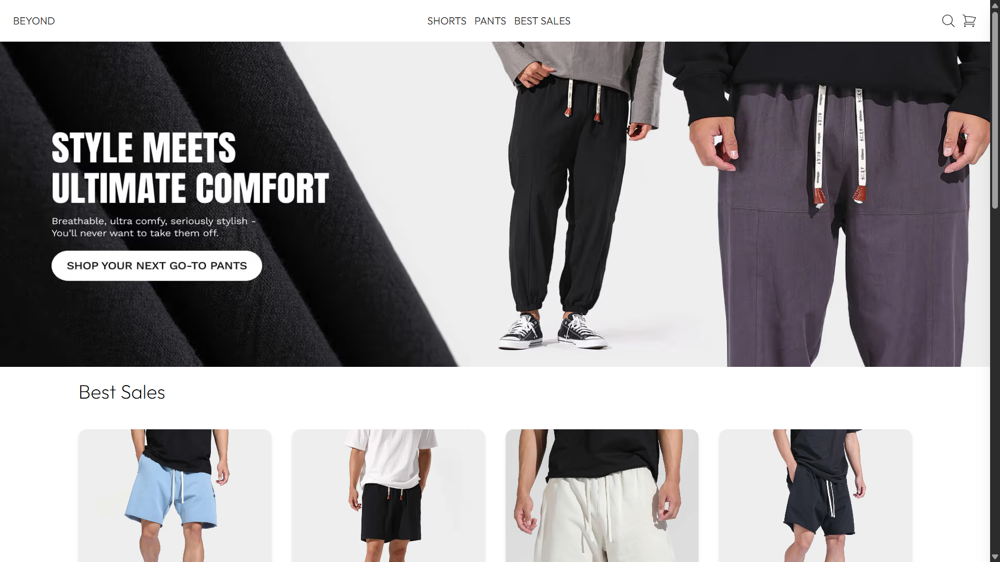
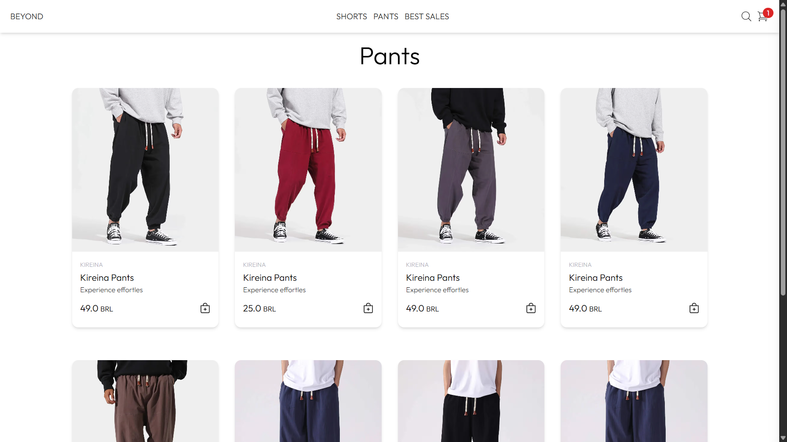
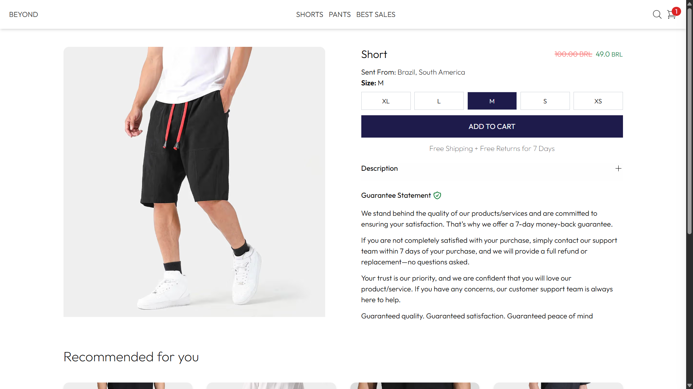
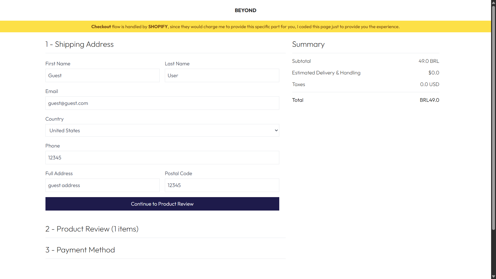
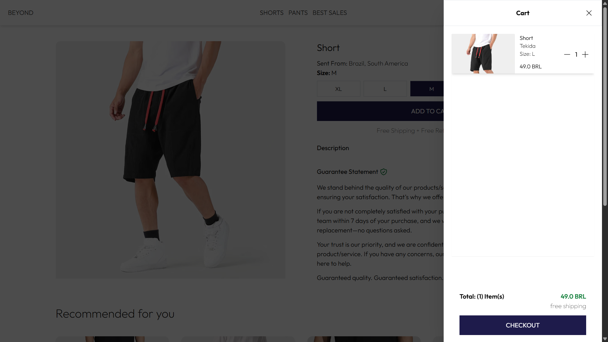
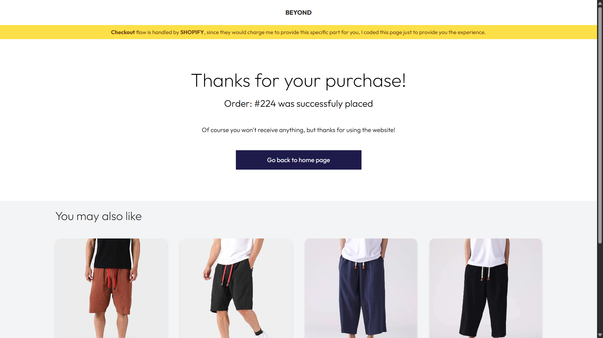
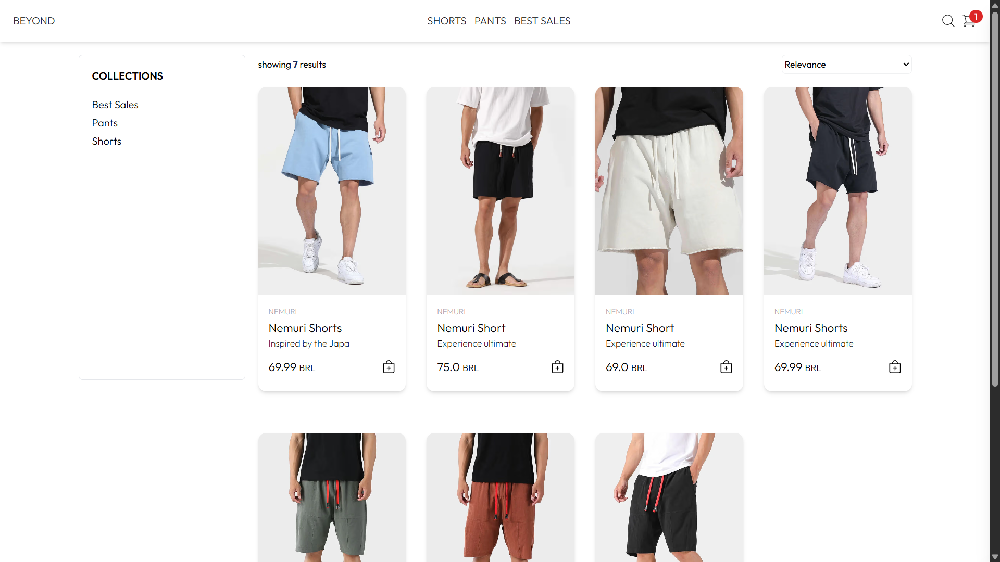

Mobile: 
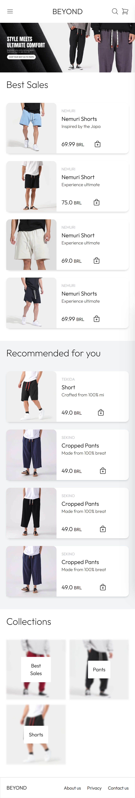
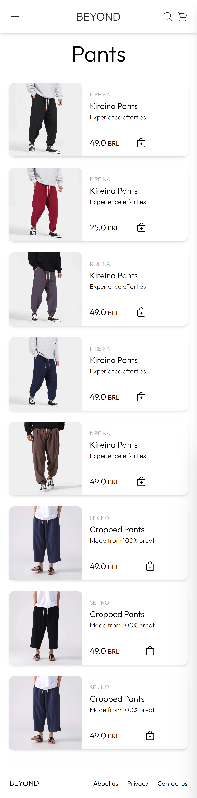
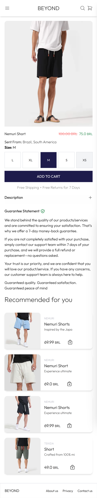
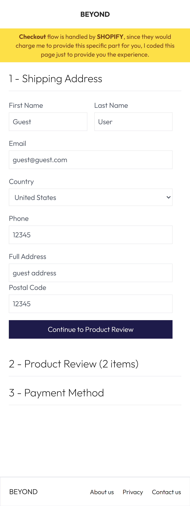
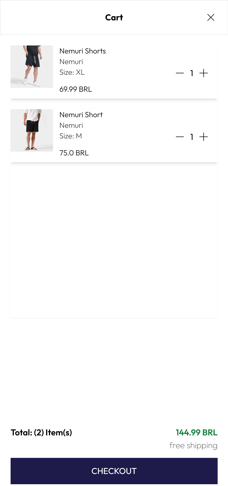
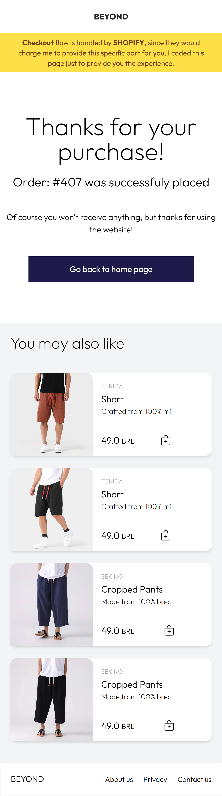
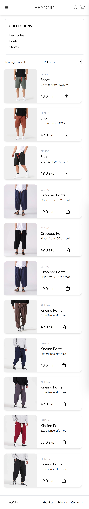

## License

The images used in this project were sourced from https://kidoriman.com/. Proper credit is given where required. Images are primarily stored in Shopify, though a few are used locally for development purposes.

## Contact

If you'd like to contact me, you can reach out via LinkedIn https://www.linkedin.com/in/crisley-a-89a3a116b/
